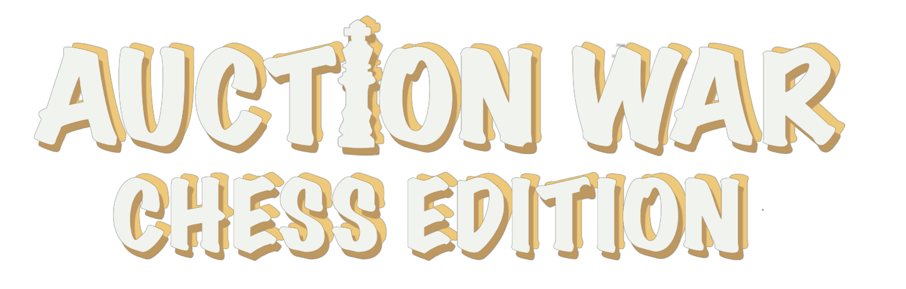

<h1 align="center" >ChessButEbay</h1>



## Introduction:
This project represents my game thesis at the university. The initial concept of the game is based on traditional chess, with a unique twist: every chess piece must be acquired through an auction before it can be used. The entire infrastructure of this project is powered by Docker, ensuring seamless integration and deployment. To begin, you will require two instances of Docker running on your computer or server. For a more streamlined development experience, it is recommended to have Node.js installed, providing you with the necessary tools for coding and refining this project.
>**_P.S._** "ChessButEbay" is just an alternative name, the official name of this game is "Auction War Chess Edition."
## Tech Stack
#### This setup utilizes Docker to run the following technologies:

- Nodejs
- nginx
- mysql
- redis
- phpmyadmin
- redisinsight
- Dozzle
  
  All components are containerized within **_Docker_**.


## How to setup (dev)
Inside the **"src"** folder, there are several subfolders: **apiCRUD, authen, socket, userImage, and web.** Each of these subfolders contains a service within a Docker container. To set up the project, follow these steps:

1. Navigate to the root of the **"src"** folder.
2. Within each subfolder **(apiCRUD, authen, socket, userImage, and web)**, execute the command ``npm i -y`` to install the required dependencies.
3. Ensure that you have a **".env"** file. You can refer to the provided [example for guidance](.env.example).
4. Once the dependencies are installed and the **".env"** files are configured, run the command ``docker-compose up`` to start the Docker containers and launch the services.

### Here's a more detailed:

1.  Open a terminal or command prompt.
2.  Change to the "src" directory using the "cd" command:
    ```
    cd path/to/src
    ```
3.  Inside each subfolder, install dependencies using "npm i -y":

      - For "apiCRUD":
        ```
        cd apiCRUD
        npm i -y
        ```
      - For "authen":
        ```
        cd ../authen
        npm i -y
        ```
      - For "socket":
        ```
        cd ../socket
        npm i -y
        ```
      - For "web":
        ```
        cd ../web
        npm i -y
        ```
      - For "userImage":
        ```
        cd ../userImage
        npm i -y
        ```
4. Create or configure the ".env" file in each subfolder. You can use the provided example as a template.
5. After setting up the dependencies and ".env" files, return to the root of the "src" directory and start the Docker containers using "docker-compose up":
   ```
   cd ..
   docker-compose up
    ```

## How to used

Once you've started all the services, you can conveniently access each one using the provided URLs, customizing them to match your own domain. This grid layout simplifies navigation within your Dockerized environment while accommodating your domain setup.

| Service      | URL        |
| ----------- | ----------- |
| Main Page     | http://localhost:80 or https://localhost:443       |
| phpMyAdmin	   | 	http://localhost:8000        |
| Dozzle	   | http://localhost:9999        |
| RedisInsight	   | http://localhost:8001        |
